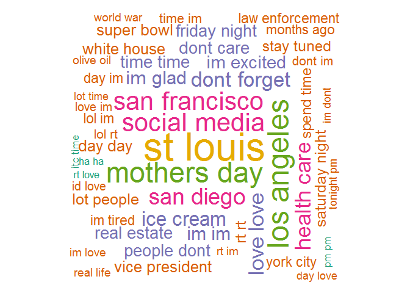
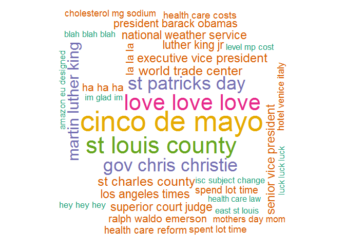

## Introduction   

This report demonstrate the level of competency achievement in working with unstructured text data to produce structured records by analyzing the [Capstone Dataset](https://d396qusza40orc.cloudfront.net/dsscapstone/dataset/Coursera-SwiftKey.zip) that can then be used for a prediction application. 

## Explortory Data Analysis
The very first step of the project is to explore what are included in the raw text data, to do the necessary cleaning, and then to separate out the useful information for build N-gram dataset. The `tidytext` package is major package that used throughout the data analys. Because size of raw data and the running of the codes from very beginning step on preparing report for publication for [RPub.com](https://rpubs.com/) was time consuming this report is based on a 10% sample of the entire data, and I will use these sample data at end of the Capstone Project.

### Tasks
Following tasks were proceeded:

* download the raw data from [Capstone Dataset](https://d396qusza40orc.cloudfront.net/dsscapstone/dataset/Coursera-SwiftKey.zip)  
* download profanity words from [Free Web Header](https://www.freewebheaders.com/full-list-of-bad-words-banned-by-google/)
* Load data and get summary information
* Pre-process files, create clean repo dataset
* Create N-grams repo dataset

## Load data and summary information   
Three text files, `en_US.blogs`, `en_US.news`, and `en_US.twitter` sourced from [Capstone Dataset](https://d396qusza40orc.cloudfront.net/dsscapstone/dataset/Coursera-SwiftKey.zip) were read into R. During file loading the `en_US.news` file contained hidden special characters that preventing a full file load and these special characters required hand deletion with an editor prior to file loading.  


f_names      f_size   f_lines    f_words     f_nchar   pct_lines   pct_words   pct_nchar
--------  ---------  --------  ---------  ----------  ----------  ----------  ----------
blogs      200.4242    899288   37334131   208361438       21.06       35.19       36.27
news       196.2775   1010242   34372529   203791399       23.66       32.40       35.47
twitter    159.3641   2360148   34372529   162385035       55.28       32.40       28.26

<!-- -->

## File Pre-processing
### Sampling the dataset
Due to R's memory limitation and performance concern I sampled 10% of the lines from each file to facilitate analysis.  

### Clean up and transformation
The dataset had been performed following clean up:  

* Remove non-alphanumeric's words,  
* Remove url's,  
* Remove words of repeated letters more than three times (+3x),  
* Convert data to lowercase,  
* Remove english stopwords,  
* Remove profanity word,  
* Remove numbers,   
* Remove punctuation characters, and  
* Strip Whitespace  


```r
source('Pre_processing.R')
```


```r
rm(list=ls())
source('Ngrams.R')
```

## Using sampled corpus to create N-grams
Now we have cleaned sample dataframe. I use `unnest_tokens` to split `text` column of the dataframe into N grames dataframe.

I create a `repo_Ngrams` method on `Ngrams.R` source so that I can use this method to create `unigram`, `bigram`, `trigram`, `quardrgram`, `quintgram`, `sexagram`, `septuagram`, `octogram`, and `nonagram`. I will demonstrate the 1, 2, 3 and 4 N-grams dataframe on the following. 


### Word (Uni-gram) and frequencies  


```r
unigram <- repo_Ngrams(1)
```

__Calculate Word frequencies__  

* Number  of  words: _164963_  
* 50%   of coverage: _1290_  
* 90%   of coverage: _18210_  
* 95%   of coverage: _40411_  
* 99%   of coverage: _131134_  

__Distribution of top 30 Words__  


```r
unigram$freq %>%
    filter(coverage <= 0.95) %>%
    top_n(30, proportion) %>%
    mutate(Unigram = reorder(words, proportion)) %>%
    ggplot(aes(Unigram, proportion)) +
    geom_col(fill='lightblue') + xlab(NULL) + coord_flip()
```

<!-- -->

__Word clouds map__  

World clouds (also known as text clouds or tag clouds) of the top 100 words you can see on the following map.

```r
unigram$freq %>%
    filter(coverage <= 0.95) %>%
    with(wordcloud(words, n, max.words = 100, 
                   colors = brewer.pal(6, 'Dark2'), random.order = FALSE))
```

<!-- -->


## Using sampled corpus to create N-grams
Now we have cleaned sample dataframe. I use `unnest_tokens` to split `text` column of the dataframe into N grames dataframe.

I create a `repo_Ngrams` method on `Ngrams.R` source so that I can use this method to create `bigram`, `trigram`, `quardrgram`, `quintgram`, `sexagram`, `septuagram`, `octogram`, and `nonagram`. I will demonstrate the 2, 3 and 4 N-grams dataframe on the following. 

### Bi-gram and frequencies  

__Create Bi-gram and calculate frequencies__  


```r
bigram <- repo_Ngrams(2)
```
* Number of bigram : _2556949_  
* 50%   of coverage: _865506_  
* 90%   of coverage: _2218660_  
* 95%   of coverage: _2387804_  
* 99%   of coverage: _2523120_ 

__Distribution of top 30 Terms__  

<!-- -->

__Word clouds map of Bi-gram__  

<!-- -->


### Tri-gram and frequencies  

__Create Tri-gram and calculate frequencies__  


```r
trigram <- repo_Ngrams(3)
```
* Number of trigram : _3327405_  
* 50%   of coverage: _1635964_  
* 90%   of coverage: _2989116_  
* 95%   of coverage: _3158260_  
* 99%   of coverage: _3293576_ 

__Distribution of top 30 Terms__  

<!-- -->

__Word clouds map__  

<!-- -->


### Quadr-gram and frequencies  

__Create Quadr-gram and calculate frequencies__  


```r
quadrgram <- repo_Ngrams(4)
```
* Number of quadrgram : _3370911_  
* 50%   of coverage: _1679472_  
* 90%   of coverage: _3032623_  
* 95%   of coverage: _3201767_  
* 99%   of coverage: _3337082_ 

__Distribution of top 30 Terms__  

<!-- -->

__Word clouds map__  

<!-- -->


## Further Development Plan: N-Gram model and prediction

Through the exploratory data analysis four n-gram dataframs and frequency tables were created and saved as `RDS` files. These files will be used on next course project for:

* Creating prediction algorithm and 
* Building Shiny app. 


### Code Example - Using N-gram for prediction 

This is a simple example of using Bi-gram to get predicted word by giving `san`. 

```r
ngram.predict <- function(str) {
    s <- str_trim(str)
    n <- ifelse(length(s) > 0, sapply(gregexpr("\\S+", s), length), 0)
    r <- NULL
    repo_ngram <- repo_Ngrams(n+1)
    r <- repo_ngram$freq[grepl(paste0('^',s,' '), repo_ngram$freq$words),]
    return(r$words)
}
head(ngram.predict('san'))
```

```
## [1] "san francisco"  "san diego"      "san jose"       "san antonio"   
## [5] "san franciscos" "san bruno"
```

```r
head(ngram.predict('amazon kindle'))
```

```
## [1] "amazon kindle clean"    "amazon kindle donc"    
## [3] "amazon kindle ereaders" "amazon kindle excited" 
## [5] "amazon kindle indiana"  "amazon kindle makes"
```


